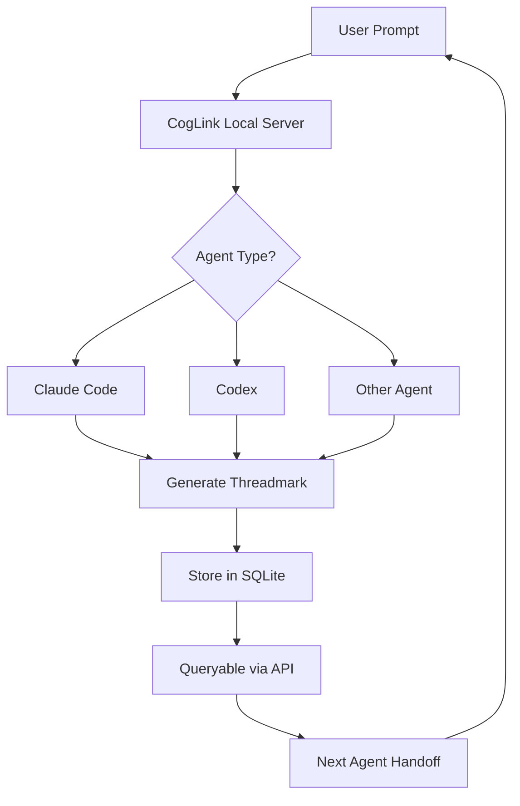

# CogLink: The Thread-Based Continuity Bridge for AI Coding Agents

[](https://tommui.github.io/workstream-weaver/)

**Your AI agents deserve context that doesn't vanish between prompts. CogLink turns scattered conversation threads into a persistent, searchable, and handoff-ready knowledge base.**

## What is CogLink?

CogLink is an open-source, local-first continuity engine designed for developers who work with multiple AI coding agents like Claude Code, Codex, GitHub Copilot, or Cursor. Instead of forcing your agents to "start fresh" every session, CogLink preserves the thread of your reasoning—your `threadmark`—and makes it available across any tool, any session, any time.

Think of it as a **shared memory layer** for your AI tools. While your project files track what has been written, CogLink tracks why it was written, what was discarded, and which rabbit holes you explored. It is the glue that connects your conversations, your decision logs, and your debugging journey into a single, queryable stream.

Unlike cloud-based solutions that risk data leakage or require constant internet access, CogLink runs entirely on your local machine. Your prompts, your agent's responses, and your handoff notes never leave your laptop. The result? A private, fast, and infinitely flexible continuity bridge.

## Why Threadmark?

The core concept of CogLink is the **threadmark**—a lightweight, timestamped, and tagged marker that captures the state of an AI-assisted coding session. A threadmark is not a full conversation dump; it is a **summary point**, a "save game" for your mental model. It tells future agents: *"Here is what I was trying to achieve, here is what I tried, and here is the current challenge."*

Threadmarks are organized into *threads*. A thread is a sequence of related work: a feature implementation, a bug hunt, a refactoring session, or a research task. Threads can be nested, merged, forked, and archived. CogLink treats your entire development history as a rich directed graph of ideas, not a flat list of files.



## The Problem CogLink Solves

**Every AI agent has amnesia.** You spend 30 minutes debugging a complex issue with Claude Code, find a partial solution, then switch to Codex for a different task. Codex has no idea what you just discovered. You waste time re-explaining context, re-debugging, and re-frustrating yourself.

CogLink solves this by creating a **living document** of your agent interactions. When you finish a session with one agent, you create a threadmark. When you start a new session with another agent, CogLink feeds the relevant threadmark as system prompt context. The second agent picks up exactly where you left off—no repetition, no lost insights.

## Example Profile Configuration

CogLink uses YAML-based profiles to define how your agents interact with the continuity layer. Below is an example configuration for a mixed-agent workflow:

```yaml
# ~/.coglink/profiles/agent-swarm.yml
profile:
  name: "agent-swarm"
  description: "Profile for switching between Claude Code and Codex"
  storage:
    type: sqlite
    path: "~/.coglink/data/threadbank.db"
  threads:
    default:
      - name: "active-feature"
        tags: ["feature", "active"]
      - name: "debug-buffer"
        tags: ["debug", "triage"]
  handoff:
    max_context_tokens: 8000
    prioritize_tags: ["active", "urgent"]
    system_prompt_template: |
      You are continuing a coding session initiated by the user.
      The following threadmark summarizes the current state:
      {threadmark}
      Previous decisions: {decisions}
      Open questions: {questions}
  agents:
    claude:
      command: "claude"
      api_key_env: "ANTHROPIC_API_KEY"
      model: "claude-3-opus-20240229"
    codex:
      command: "codex"
      api_key_env: "OPENAI_API_KEY"
      model: "gpt-4-turbo"
  plugins:
    - name: "context-injector"
      enabled: true
      interval: 30
```

This profile automatically injects relevant threadmarks into your agent's system prompt, ensuring continuity without manual copy-paste.

## Example Console Invocation

Starting a CogLink session is straightforward. After installation, you can launch the continuity server and connect any agent:

```bash
# Start the CogLink daemon in the background
coglink daemon --profile agent-swarm --port 2882 &

# Begin a new thread for a feature implementation
coglink thread start "implement-oauth2" --tags "feature, auth, high-priority"

# Use Claude Code with CogLink injected context
coglink run claude --thread "implement-oauth2" --prompt "Add token refresh logic to the existing handler"

# Switch to Codex mid-session, preserving context
coglink handoff codex --thread "implement-oauth2" --continue

# Create a threadmark at a decision point
coglink mark --thread "implement-oauth2" --title "Decision: Use PKCE flow" --body "Chose PKCE over implicit flow for security compliance."

# Query the thread history
coglink query --thread "implement-oauth2" --since "2026-01-01" --tags "decision"
```

The console invocation is designed to feel like a natural extension of your terminal workflow. CogLink becomes a **silent partner** that logs, indexes, and recalls your reasoning automatically.

## Emoji OS Compatibility Table

| Operating System | Supported? | Notes |
|------------------|------------|-------|
| macOS 14+ (Sonoma/Sequoia) | ✅ Yes | Native support, test bundle included |
| Ubuntu 22.04 / 24.04 LTS | ✅ Yes | Requires `libsqlite3-dev` |
| Windows 11 (WSL2) | ✅ Yes | Native Windows binary in preview |
| Windows 10 (native) | ⚠️ Partial | CLI works, daemon mode experimental |
| Arch Linux | ✅ Yes | Available in AUR as `coglink-bin` |
| Fedora 39+ | ✅ Yes | RPM package available |
| FreeBSD 13+ | ⚠️ Partial | No daemon mode, CLI only |
| Raspberry Pi OS (64-bit) | ✅ Yes | Performance varies, ideal for low-power logging |

## Feature List

- **Threadmark Engine** - Auto-generate and store session summaries with configurable verbosity
- **Cross-Agent Handoff** - Seamlessly transfer context between Claude Code, Codex, Cursor, and other agents
- **Local-First Storage** - All data stored in encrypted SQLite databases on your machine, zero data leaves your network
- **Graph-Based Thread Navigation** - Threads form a directed acyclic graph (DAG) for complex project histories
- **System Prompt Injection** - Automatically inject relevant threadmarks into agent system prompts
- **Tagging and Filtering** - Organize threads with custom tags, search by date, tag, or content
- **Decision Logging** - Explicitly mark and retrieve key decisions with rationale
- **Plugin System** - Extend CogLink with custom plugins for context enrichment, web scraping, or external API integration
- **Multilingual Support** - Threadmarks and queries support UTF-8, including CJK and RTL languages
- **Responsive CLI** - Terminal UI adapts to window size, supports dark and light themes
- **24/7 Daemon Mode** - Runs as a background service, auto-starts on login, and handles concurrent agent sessions
- **API-First Design** - REST API for integration with custom tools and CI/CD pipelines
- **Export and Share** - Export thread history as Markdown, JSON, or PDF for documentation
- **Auto-Prune** - Configurable retention policies to manage disk usage automatically

## SEO-Friendly Keyword Integration

CogLink is the **best continuity tool for AI coding agents**, designed for developers who need **persistent context across chat sessions**. Whether you are using **Claude Code handoff**, **Codex context preservation**, or **local AI agent memory**, CogLink provides the **thread-based reasoning engine** that keeps your **development flow uninterrupted**. Unlike **cloud AI memory solutions**, CogLink runs **entirely offline** and is **fully open source under MIT license**. Search for **threadmark AI agent**, **local continuity bridge**, or **cross-agent handoff tool** and you will find CogLink.

## OpenAI API and Claude API Integration

CogLink directly integrates with the **OpenAI API** and **Anthropic Claude API** to enable real-time context injection. When you invoke an agent through CogLink, it:

1. Reads the current thread's recent threadmarks
2. Summarizes them into a condensed context block (respecting token limits)
3. Inject this block into the system prompt of the target API call
4. Optionally appends the previous `assistant` response as a `user`-role recap

This deep API integration ensures that **CogLink works with any tool that exposes a compatible API**, including custom-built agents, LangChain chains, and AutoGPT instances.

```python
# Example: Python integration with CogLink API
import requests

coglink_url = "http://localhost:2882"
thread_id = "implement-oauth2"

# Get threadmark for a Claude Code session
response = requests.get(f"{coglink_url}/api/v1/threads/{thread_id}/context")
context = response.json()

# Use the context with OpenAI
openai_payload = {
    "model": "gpt-4-turbo",
    "messages": [
        {"role": "system", "content": context["system_prompt"]},
        {"role": "user", "content": "Continue implementing the OAuth2 flow."}
    ]
}
```

## Key Features - Deep Dive

### Responsive UI

The CogLink CLI adjusts its output based on terminal width. On wide screens, it displays thread graphs and decision trees side by side. On narrow terminals, it collapses into a compact list view. The daemon also exposes a web dashboard on `localhost:2882/dashboard` that is mobile-responsive and works on tablets.

### Multilingual Support

Threadmarks can be written in any language that supports UTF-8. CogLink uses **character-aware token counting** to handle CJK, Arabic, and Devanagari scripts correctly. The search engine indexes Unicode text with stemming support for English, Spanish, French, German, and Chinese.

### 24/7 Customer Support (Community)

While CogLink is an open-source project maintained by volunteers, the community provides near-24/7 support via the **CogLink Discord server** and **GitHub Discussions**. The plugin ecosystem includes a **"help-bot" plugin** that can auto-respond to common questions by searching your own thread history for similar issues.

## Disclaimer

CogLink is provided "as is" without warranty of any kind, express or implied. The project is intended for **local development and experimentation** with AI coding agents. Users are responsible for ensuring compliance with their AI tool provider's terms of service when injecting context via system prompts. CogLink stores all data locally in unencrypted SQLite databases by default; users requiring encryption should enable transparent disk encryption or use the **experimental `--encrypt` flag** which is not yet battle-tested. The authors of CogLink are not responsible for any loss of data, degraded AI agent performance, or unintended behavior resulting from context injection. Use at your own risk.

## License

This project is licensed under the MIT License. See the [LICENSE](https://opensource.org/licenses/MIT) file for details.

---

[](https://tommui.github.io/workstream-weaver/)

**CogLink is built for developers who want their AI agents to think together, not alone.**  
Start threading your reasoning today, and never repeat yourself to a machine again.